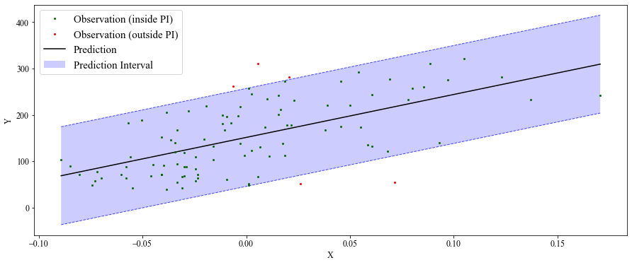

<div align="center">
    <a href="#">
        
    </a>
    <a href="#">
        
    </a>
</div>
<br>

Predictive UNcertainty Calibration and Conformalization (PUNCC) is an open-source library that enables ad-hoc integration of AI models into a theoretically sound uncertainty estimation framework based on conformal prediction. Prediction sets are constructed with guaranteed coverage probability according to a nominal level of error $\alpha$.

## 📚 Table of contents

- [🐾 Instalation](#-installation)
- [🚀 Quick Start](#-quickstart)
- [📚 Citation](#-citation)
- [💻 Contributing](#-contributing)
- [📝 License](#-license)
- [🙏 Acknowledgments](#-acknowledgments)

# 🐾 Installation

## Clone the repo

```bash
git clone ssh://git@forge.deel.ai:22012/statistic-guarantees/puncc.git
```

## Installation

It is recommended to install puncc in a virtual environment to not mess with your system's dependencies.

### Using pip

#### For developpers

```bash
pip install -e .[dev]
```

#### For users
```bash
pip install -e .[interactive]
```

### Using makefile

```bash
make prepare-dev
```

### From Makefile

```bash
make prepare-dev
```

# 🚀 Quickstart

Let’s consider a simple regression problem on diabetes data provided by Scikit-learn. We want to evaluate the uncertainty associated with the prediction using inductive (or split) conformal prediction.

### Data

By construction, data are indepent and identically distributed (i.i.d) (for
more information, check the official
[documentation](https://www4.stat.ncsu.edu/~boos/var.select/diabetes.html).
Great: we fullfill the exchangeability condition to apply conformal prediction!
The next step is spliting the data into three subsets:

* Fit subset ${\cal D_{fit}}$ to train the model.
* Calibration subset ${\cal D_{calib}}$ on which nonconformity scores are
  computed.
* Test subset ${\cal D_{test}}$ on which the prediction intervals are
  estimated.

---
**NOTE**

   Rigorously, for the probabilistic guarantee to hold, the calibration subset
   needs to be sampled for each new example in the test set.

---


The following code implements all the aforementioned steps:

```python
import numpy as np
from sklearn import datasets

# Load the diabetes dataset
diabetes_X, diabetes_y = datasets.load_diabetes(return_X_y=True)

# Use only one feature
diabetes_X = diabetes_X[:, np.newaxis, 2]

# Split the data into training/testing sets
X_train = diabetes_X[:-100]
X_test = diabetes_X[-100:]

# Split the targets into training/testing sets
y_train = diabetes_y[:-100]
y_test = diabetes_y[-100:]

# Split fit and calibration data
X_fit, X_calib = X_train[:-100], X_train[-100:]
y_fit, y_calib = y_train[:-100], y_train[-100:]
```
## Prediction Model

We consider a simple linear regression model from
[scikit-learn regression module](https://scikit-learn.org/stable/modules/linear_model.html),
to be trained later on ${\cal D_{fit}}$:

```python
from sklearn import linear_model

# Create linear regression model
lin_reg_model = linear_model.LinearRegression()
```

Such model needs to be wrapped in a wrapper provided in the module
`deel.puncc.api.prediction`.
The wrapper makes it possible to use various models from different ML/DL
libraries such as [Scikit-learn](https://scikit-learn.org/),
[Keras](https://keras.io/) or
[XGBoost](https://xgboost.readthedocs.io/en/stable/).
For more information about model wrappers and supported ML/DL libraries,
we refere the user to the documentation.

For a linear regression from scikit-learn, we use `deel.puncc.api.prediction.BasePredictor` as follows:

```python
from deel.puncc.api.prediction import BasePredictor

# Create a predictor to wrap the linear regression model defined earlier
# The argument `is_trained` is set to False such that the linear model needs to be
# trained before the calibration. You can initialize it to True if the model is
# already trained and you want to save time.
lin_reg_predictor =  BasePredictor(lin_reg_model, is_trained=False)
```


## Split Conformal Regression
For this example, the prediction intervals are obtained throught the split
conformal prediction method provided by the class
`deel.puncc.regression.SplitCP`. Other methods are presented
in the documentation.


```python
from deel.puncc.regression import SplitCP

# Coverage target is 1-alpha = 90%
alpha=.1

# Instanciate the split cp wrapper around the linear predictor.
# The `train` argument is set to True such that the linear model is trained
# before the calibration. You can initialize it to False if the model is
# already trained and you want to save time.
split_cp = SplitCP(lin_reg_predictor, train=True)

# Train model (if argument `train` is True) on the fitting dataset and
# compute the residuals on the calibration dataset.
split_cp.fit(X_fit, y_fit, X_calib, y_calib)

# The `predict` returns the output of the linear model `y_pred` and
# the calibrated interval [`y_pred_lower`, `y_pred_upper`].
y_pred, y_pred_lower, y_pred_upper = split_cp.predict(X_test, alpha=alpha)
```

The library provides several metrics in `deel.puncc.metrics` to evaluate
the conformalization procedure. Below, we compute the average empirical coverage
and the average empirical width of the prediction intervals on the test examples:

```python
from deel.puncc import metrics

coverage = metrics.regression_mean_coverage(y_test, y_pred_lower, y_pred_upper)
width = metrics.regression_sharpness(y_pred_lower=y_pred_lower,
                                    y_pred_upper=y_pred_upper)
print(f"Marginal coverage: {np.round(coverage, 2)}")
print(f"Average width: {np.round(width, 2)}")
```

In addition, `puncc` provides plotting tools in `deel.puncc.plotting`
to visualize the prediction intervals and whether or not the observations
are covered:

```python
from deel.puncc.plotting import plot_prediction_intervals

# Figure of the prediction bands

plot_prediction_intervals(
    X = X_test[:,0],
    y_true=y_test,
    y_pred=y_pred,
    y_pred_lower=y_pred_lower,
    y_pred_upper=y_pred_upper,
    sort_X=True,
    size=(10, 6),
    loc="upper left")
```



In the long run, at least 90% of the examples are included in the prediction interval.

### Further readings: High-level and low-level APIs
The library `puncc` provides two ways of defining and using conformal prediction wrappers:
- **High-level API**: a direct approach to run state of the art conformal prediction procedures. This is what we used in the previous conformal regression example.
- **Low-level API**: a more flexible approach based of full customization of the prediction model, the choice of nonconformity scores and the split between fit and calibration datasets.

A quick comparison of both approaches is provided [here](docs/quickstart.ipynb) for a simple regression problem.

## 📚 Citation

This library was initially built to support the work presented in our COPA 2022 paper on conformal prediction for timeseries. If you use our library for your work, please cite our paper:

```
@inproceedings{mendil2022robust,
  title={Robust Gas Demand Forecasting With Conformal Prediction},
  author={Mendil, Mouhcine and Mossina, Luca and Nabhan, Marc and Pasini, Kevin},
  booktitle={Conformal and Probabilistic Prediction with Applications},
  pages={169--187},
  year={2022},
  organization={PMLR}
}
```

## 💻 Contributing

Contributions are welcome! Feel free to report an issue or open a pull
request. Take a look at our guidelines [here](CONTRIBUTING.md).

## 🔑 License

The package is released under [MIT](LICENSES/headers/MIT-Clause.txt) license.

Copyright IRT Antoine de Saint Exupéry et Université Paul Sabatier Toulouse III - All
rights reserved. DEEL is a research program operated by IVADO, IRT Saint Exupéry, CRIAQ
and ANITI - https://www.deel.ai/

## 🙏 Acknowledgments


This project received funding from the French ”Investing for the Future – PIA3” program within the Artificial and Natural Intelligence Toulouse Institute (ANITI). The authors gratefully acknowledge the support of the <a href="https://www.deel.ai/"> DEEL </a> project.
