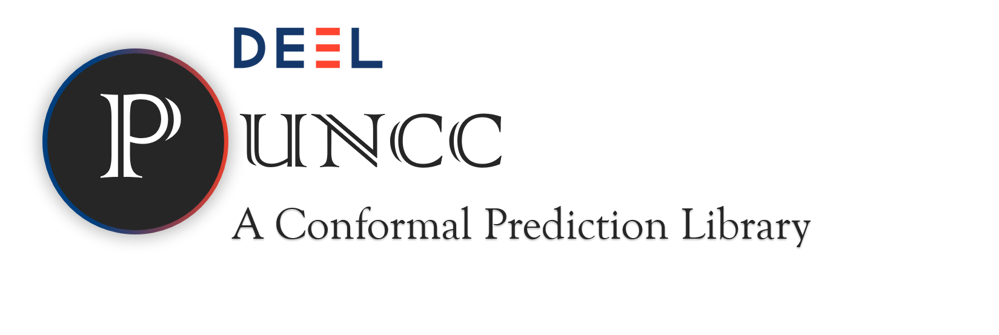

<!-- Banner -->
<div align="center">
<picture>
  <source media="(prefers-color-scheme: dark)" srcset="docs/assets/banner_dark.png">
  <source media="(prefers-color-scheme: light)" srcset="docs/assets/banner_light.png">
  
</picture>
</div>
<br>

<!-- Badges -->
<div align="center">
  <a href="#">
    
  </a>
  <a href="#">
    
  </a>
  <a href="https://github.com/deel-ai/puncc/actions/workflows/linter.yml">
    
  </a>
  <a href="https://github.com/deel-ai/puncc/actions/workflows/tests.yml">
    
  </a>
</div>
<br>

***Puncc*** (short for **P**redictive **un**certainty **c**alibration and **c**onformalization) is an open-source Python library. It seamlessly integrates a collection of state-of-the-art conformal prediction algorithms and associated techniques for diverse machine learning tasks, including regression, classification, object detection and anomaly detection.
***Puncc*** can be used with any predictive model to provide rigorous uncertainty estimations.
Under data exchangeability (or *i.i.d*), the generated prediction sets are guaranteed to cover the true outputs within a user-defined error $\alpha$.

Documentation is available [**online**](https://deel-ai.github.io/puncc/index.html).

## 📚 Table of contents

- [🐾 Installation](#-installation)
- [📖 Documentation](#-documentation)
- [👨‍🎓 Tutorials](#-tutorials)
- [🚀 QuickStart](#-quickstart)
- [📚 Citation](#-citation)
- [💻 Contributing](#-contributing)
- [🙏 Acknowledgments](#-acknowledgments)
- [👨‍💻 Creators](#-creators)
- [📝 License](#-license)

## 🐾 Installation

*puncc* requires a version of python higher than 3.8 and several libraries including Scikit-learn and Numpy. It is recommended to install *puncc* in a virtual environment to not mess with your system's dependencies.

You can directly install the library using pip:

```bash
pip install puncc
```

<!--
You can alternatively clone the repo and use the makefile to automatically create a virtual environment
and install the requirements:

* For users:

```bash
make install-user
```

* For developpers:

```bash
make prepare-dev
```
-->

## 📖 Documentation

For comprehensive documentation, we encourage you to visit the [**official documentation page**](https://deel-ai.github.io/puncc/index.html).

## 👨‍🎓 Tutorials


We highly recommend following the introductory tutorials to get familiar with the library and its API.

| Tutorial | Description | Link |
|----------|-------------|------|
| **Introduction Tutorial** | Get started with the basics of *puncc*. | [](docs/puncc_intro.ipynb)  [](https://githubtocolab.com/deel-ai/puncc/blob/main/docs/puncc_intro.ipynb) |
| **API Tutorial** | Learn about *puncc*'s API. | [](docs/api_intro.ipynb)  [](https://githubtocolab.com/deel-ai/puncc/blob/main/docs/api_intro.ipynb) |
| **Tutorial on CP with PyTorch** | Learn how to use *puncc* with PyTorch. | [](docs/puncc_pytorch.ipynb)  [](https://githubtocolab.com/deel-ai/puncc/blob/main/docs/puncc_pytorch.ipynb) |
| **Conformal Object Detection** | Learn to conformalize an object detector. | [](docs/puncc_cod.ipynb) [](https://githubtocolab.com/deel-ai/puncc/blob/main/docs/puncc_cod.ipynb) |
| **Architecture Overview** | Detailed overview of *puncc*'s architecture. | [](docs/puncc_architecture.ipynb) [](https://githubtocolab.com/deel-ai/puncc/blob/main/docs/puncc_architecture.ipynb) |

## 🚀 Quickstart

Conformal prediction enables to transform point predictions into interval predictions with high probability of coverage. The figure below shows the result of applying the split conformal algorithm on a linear regressor.

<figure style="text-align:center">

</figure>

Many conformal prediction algorithms can easily be applied using *puncc*.  The code snippet below shows the example of split conformal prediction with a pretrained linear model:

 ```python
 from deel.puncc.api.prediction import BasePredictor
from deel.puncc.regression import SplitCP

# Load calibration and test data
# ...

# Pretrained regression model
# trained_linear_model = ...

# Wrap the model to enable interoperability with different ML libraries
trained_predictor =  BasePredictor(trained_linear_model)

# Instanciate the split conformal wrapper for the linear model.
# Train argument is set to False because we do not want to retrain the model
split_cp = SplitCP(trained_predictor, train=False)

# With a calibration dataset, compute (and store) nonconformity scores
split_cp.fit(X_calib=X_calib, y_calib=y_calib)

# Obtain the model's point prediction y_pred and prediction interval
# PI = [y_pred_lower, y_pred_upper] for a target coverage of 90% (1-alpha).
y_pred, y_pred_lower, y_pred_upper = split_cp.predict(X_test, alpha=0.1)
```


The library provides several metrics (`deel.puncc.metrics`) and plotting capabilities (`deel.puncc.plotting`) to evaluate and visualize the results of a conformal procedure. For a target error rate of $\alpha = 0.1$, the marginal coverage reached in this example on the test set is higher than $90$% (see [**Introduction tutorial**](docs/puncc_intro.ipynb)):
<div align="center">
<figure style="text-align:center">

<div align=center>90% Prediction Interval with Split Conformal Prediction.</div>
</figure>
</div>
<br>

### More flexibility with the API

*Puncc* provides two ways of defining and using conformal prediction wrappers:
- A direct approach to run state-of-the-art conformal prediction procedures. This is what we used in the previous conformal regression example.
- **Low-level API**: a more flexible approach based of full customization of the prediction model, the choice of nonconformity scores and the split between fit and calibration datasets.

A quick comparison of both approaches is provided in the [**API tutorial**](docs/api_intro.ipynb) for a regression problem.

<figure style="text-align:center">
    
</figure>

### 🖥️ Implemented Algorithms
<details>
  <summary>Overview of Implemented Methods from the Literature:</summary>

| Procedure Type                          | Procedure Name                                        | Description (more details in [Theory overview](https://deel-ai.github.io/puncc/theory_overview.html))                |
|-----------------------------------------|------------------------------------------------------|-------------------------------------------------------|
| Conformal Regression                    | [`deel.puncc.regression.SplitCP`](https://deel-ai.github.io/puncc/regression.html#deel.puncc.regression.SplitCP)                      | Split Conformal Regression                            |
| Conformal Regression                    | [`deel.puncc.regression.LocallyAdaptiveCP`](https://deel-ai.github.io/puncc/regression.html#deel.puncc.regression.LocallyAdaptiveCP)            | Locally Adaptive Conformal Regression                 |
| Conformal Regression                    | [`deel.puncc.regression.CQR`](https://deel-ai.github.io/puncc/regression.html#deel.puncc.regression.CQR)                         | Conformalized Quantile Regression                     |
| Conformal Regression                    | [`deel.puncc.regression.CvPlus`](https://deel-ai.github.io/puncc/regression.html#deel.puncc.regression.CVPlus)                       | CV + (cross-validation)                               |
| Conformal Regression                    | [`deel.puncc.regression.EnbPI`](https://deel-ai.github.io/puncc/regression.html#deel.puncc.regression.EnbPI)                        | Ensemble Batch Prediction Intervals method            |
| Conformal Regression                    | [`deel.puncc.regression.aEnbPI`](https://deel-ai.github.io/puncc/regression.html#deel.puncc.regression.AdaptiveEnbPI)                       | Locally adaptive Ensemble Batch Prediction Intervals method |
| Conformal Classification                | [`deel.puncc.classification.LAC`](https://deel-ai.github.io/puncc/classification.html#deel.puncc.classification.LAC)                      | Least Ambiguous Set-Valued Classifiers                |
| Conformal Classification                | [`deel.puncc.classification.APS`](https://deel-ai.github.io/puncc/classification.html#deel.puncc.classification.APS)                      | Adaptive Prediction Sets                              |
| Conformal Classification                | [`deel.puncc.classification.RAPS`](https://deel-ai.github.io/puncc/classification.html#deel.puncc.classification.RAPS)                     | Regularized Adaptive Prediction Sets (APS is a special case where $\lambda = 0$) |
| Conformal Anomaly Detection             | [`deel.puncc.anomaly_detection.SplitCAD`](https://deel-ai.github.io/puncc/anomaly_detection.html#deel.puncc.anomaly_detection.SplitCAD)              | Split Conformal Anomaly detection (used to control the maximum false positive rate) |
| Conformal Object Detection              | [`deel.puncc.object_detection.SplitBoxWise`](https://deel-ai.github.io/puncc/object_detection.html#deel.puncc.object_detection.SplitBoxWise)           | Box-wise split conformal object detection             |

</details>

## 📚 Citation

If you use our library for your work, please cite our paper:

```
@inproceedings{mendil2023puncc,
  title={PUNCC: a Python Library for Predictive Uncertainty Calibration and Conformalization},
  author={Mendil, Mouhcine and Mossina, Luca and Vigouroux, David},
  booktitle={Conformal and Probabilistic Prediction with Applications},
  pages={582--601},
  year={2023},
  organization={PMLR}
}
```

*Puncc* has been used to support the work presented in our COPA 2022 paper on conformal prediction for time series.

```
@inproceedings{mendil2022robust,
  title={Robust Gas Demand Forecasting With Conformal Prediction},
  author={Mendil, Mouhcine and Mossina, Luca and Nabhan, Marc and Pasini, Kevin},
  booktitle={Conformal and Probabilistic Prediction with Applications},
  pages={169--187},
  year={2022},
  organization={PMLR}
}
```


## 🙏 Acknowledgments


This project received funding from the French ”Investing for the Future – PIA3” program within the Artificial and Natural Intelligence Toulouse Institute (ANITI). The authors gratefully acknowledge the support of the <a href="https://www.deel.ai/"> DEEL </a> project.

## 👨‍💻 About the Developers

Puncc's development team is a group of passionate scientists and engineers who are committed to developing a dependable and user-friendly open-source software. We are always looking for new contributors to this initiative. If you are interested in helping us develop puncc, please feel free to get involved.

## 💻 Contributing

Contributions are welcome! Feel free to report an issue or open a pull
request. Take a look at our guidelines [here](CONTRIBUTING.md).

## 🔑 License

The package is released under [MIT](LICENSES/headers/MIT-Clause.txt) license.
