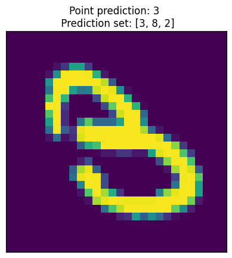
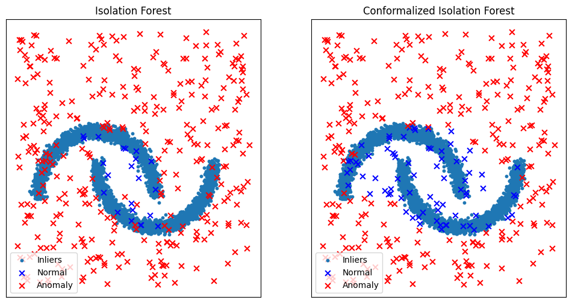

==================
🚀 Quickstart
==================

.. contents:: Table of Contents
    :depth: 3

📈 Conformal Regression
-----------------------

Let's consider a simple regression problem on diabetes data provided in
`Scikit-learn <https://scikit-learn.org/stable/datasets/toy_dataset.html#diabetes-dataset>`_.
We want to evaluate the uncertainty associated with the prediction using **inductive (or split) conformal prediction**.

💾 Diabetes Dataset
*******************

The dataset contains information about 442 diabetes patients. The goal is
predict from physiological variables a quantitative measure of disease
progression in one year.

* There are ten standardized features corresponding to the age, sex, body mass
  index, average blood pressure, and six blood serum measurements.
* The target is the measure of diabetes progression during one year for each
  patient.

for more information, check the official
`documentation <https://www4.stat.ncsu.edu/~boos/var.select/diabetes.html>`_.

.. code-block:: python

   from sklearn import datasets

   # Load the diabetes dataset
   diabetes_X, diabetes_y = datasets.load_diabetes(return_X_y=True)

   print(f"Features shape: {diabetes_X.shape}")
   print(f"Target's shape: {diabetes_y.shape}")

.. code-block:: HTML

   Features shape: (442, 10)
   Target's shape: (442,)

From all the features, we want our model to capture only the link between
body mass index and the evolution of the disease.

.. code-block:: python

   import numpy as np

   # Use only BMI feature
   diabetes_X = diabetes_X[:, 2, np.newaxis]

By construction, data are indepent and identically distributed (i.i.d).

Great, we fullfill the prerequisites to apply conformal prediction 👏!

The next step is spliting the data into three subsets:

* Fit subset :math:`{\cal D_{fit}}` to train the model.
* Calibration subset :math:`{\cal D_{calib}}` on which nonconformity scores are
  computed.
* Test subset :math:`{\cal D_{test}}` on which the prediction intervals are
  estimated.

.. warning::

   Rigorously, for the probabilistic guarantee to hold, the calibration subset
   needs to be sampled for each new example in the test set.

The following code implements all the aforementioned steps:

.. code-block:: python

   # Split the data into training/testing sets
   X_train = diabetes_X[:-100]
   X_test = diabetes_X[-100:]

   # Split the targets into training/testing sets
   y_train = diabetes_y[:-100]
   y_test = diabetes_y[-100:]

   # Split fit and calibration data
   X_fit, X_calib = X_train[:-100], X_train[-100:]
   y_fit, y_calib = y_train[:-100], y_train[-100:]

🔮 Prediction model
*******************

We consider a simple linear regression model from
`scikit-learn regression module <https://scikit-learn.org/stable/modules/linear_model.html>`_,
to be trained later on :math:`{\cal D_{fit}}`:

.. code-block:: python

   from sklearn import linear_model

   # Create linear regression model
   lin_reg_model = linear_model.LinearRegression()

Such model needs to be wrapped in a wrapper provided in the module
:mod:`deel.puncc.api.prediction`.
The wrapper makes it possible to use various models from different ML/DL
libraries such as `Scikit-learn <https://scikit-learn.org/>`__,
`Keras <https://keras.io/>`_ or
`XGBoost <https://xgboost.readthedocs.io/en/stable/>`_. **An example of**
:ref:`conformal classification <classification example>` **with keras models
is provided later in this page**.
For more information about model wrappers and supported ML/DL libraries,
checkout :doc:`the documentation <prediction>`.

For a linear regression from scikit-learn, we use
:class:`deel.puncc.api.prediction.BasePredictor` as follows:

.. code-block:: python

   from deel.puncc.api.prediction import BasePredictor

   # Create a predictor to wrap the linear regression model defined earlier
   lin_reg_predictor =  BasePredictor(lin_reg_model)

⚙️ Conformal prediction
************************

For this example, the prediction intervals are obtained throught the split
conformal prediction method provided by the class
:class:`deel.puncc.regression.SplitCP`. Other methods are presented
:doc:`here <regression>`.

.. code-block:: python

   from deel.puncc.regression import SplitCP

   # Coverage target is 1-alpha = 90%
   alpha=.1

   # Instanciate the split cp wrapper around the linear predictor.
   # The `train` argument is set to True such that the linear model is trained
   # before the calibration. You can initialize it to False if the model is
   # already trained and you want to save time.
   split_cp = SplitCP(lin_reg_predictor, train=True)

   # Train model (if argument `train` is True) on the fitting dataset and
   # compute the residuals on the calibration dataset.
   split_cp.fit(X_fit=X_fit, y_fit=y_fit, X_calib=X_calib, y_calib=y_calib)

   # The `predict` returns the output of the linear model `y_pred` and
   # the calibrated interval [`y_pred_lower`, `y_pred_upper`].
   y_pred, y_pred_lower, y_pred_upper = split_cp.predict(X_test, alpha=alpha)

The library provides several metrics in :mod:`deel.puncc.metrics` to evaluate
the conformalization procedure. Below, we compute the average empirical coverage
and the average empirical width of the prediction intervals on the test examples:

.. code-block:: python

   from deel.puncc import metrics

   coverage = metrics.regression_mean_coverage(y_test, y_pred_lower, y_pred_upper)
   width = metrics.regression_sharpness(y_pred_lower=y_pred_lower,
                                        y_pred_upper=y_pred_upper)
   print(f"Marginal coverage: {np.round(coverage, 2)}")
   print(f"Average width: {np.round(width, 2)}")

.. code-block:: HTML

   Marginal coverage: 0.95
   Average width: 211.38

In addition, `puncc` provides plotting tools in :mod:`deel.puncc.plotting`
to visualize the prediction intervals and whether or not the observations
are covered:

.. code-block::python

   from deel.puncc.plotting import plot_prediction_interval

   # Figure of the prediction bands

   plot_prediction_interval(
      X = X_test[:,0],
      y_true=y_test,
      y_pred=y_pred,
      y_pred_lower=y_pred_lower,
      y_pred_upper=y_pred_upper,
      sort_X=True,
      size=(10, 6),
      loc="upper left")

.. figure:: ../assets/results_quickstart_split_cp_pi.png
   :width: 600px
   :align: center
   :height: 300px
   :figclass: align-center

   90%-prediction interval with the split conformal prediction method

📊 Conformal Classification
---------------------------

Let's tackle the classic problem of
`MNIST handwritten digits <https://en.wikipedia.org/wiki/MNIST_database>`_
classification. The goal is to evaluate through **conformal prediction** the
uncertainty associated with predictive classifiers.

💾 MNIST Dataset
****************

MNIST dataset contains a large number of :math:`28 \times 28` digit images to which are associated digit labels.
As the data generating process is considered i.i.d (check `this post <https://newsletter.altdeep.ai/p/the-story-of-mnist-and-the-perils>`_),
conformal prediction is applicable 👏.

We split the data into three subsets:

* Fit subset :math:`{\cal D_{fit}}` to train the model.
* Calibration subset :math:`{\cal D_{calib}}` on which nonconformity scores are
  computed.
* Test subset :math:`{\cal D_{test}}` on which the prediction intervals are
  estimated.

.. warning::

   Rigorously, for the probabilistic guarantee to hold, the calibration subset
   needs to be sampled for each new example in the test set.

In addition to data preprocessing, the following code implements the
aforementioned steps:

.. code-block:: python

   from tensorflow.keras.datasets import mnist
   from tensorflow.keras.utils import to_categorical

   # Load MNIST Database
   (X_train, y_train), (X_test, y_test) = mnist.load_data()

   # Preprocessing: reshaping and standardization
   X_train = X_train.reshape((len(X_train), 28, 28))
   X_train = X_train.astype('float32') / 255
   X_test = X_test.reshape((len(X_test), 28 , 28))
   X_test = X_test.astype('float32') / 255

   # Split fit and calib datasets
   X_fit, X_calib  = X_train[:50000], X_train[50000:]
   y_fit, y_calib  = y_train[:50000], y_train[50000:]

   # One hot encoding of classes
   y_fit_cat = to_categorical(y_fit)
   y_calib_cat = to_categorical(y_calib)
   y_test_cat = to_categorical(y_test)

🔮 Prediction Model
*******************

We consider a convnet defined as follows:

.. code-block:: python

   from tensorflow import random
   from tensorflow import keras
   from tensorflow.keras import layers

   random.set_seed(42)

   # Classification model: convnet composed of two convolution/pooling layers
   # and a dense output layer
   nn_model = keras.Sequential(
      [
         keras.Input(shape=(28, 28, 1)),
         layers.Conv2D(16, kernel_size=(3, 3), activation="relu"),
         layers.MaxPooling2D(pool_size=(2, 2)),
         layers.Conv2D(32, kernel_size=(3, 3), activation="relu"),
         layers.MaxPooling2D(pool_size=(2, 2)),
         layers.Flatten(),
         layers.Dense(10, activation="softmax"),
      ]
   )

For the convnet above, we use :class:`deel.puncc.api.prediction.BasePredictor` as wrapper.
Note that our model is not already trained (`is_trained = False`), we need to provide the compilation config to the constructor:

.. code-block:: python

   from deel.puncc.api.prediction import BasePredictor

   # The compilation details are gathered in a dictionnary
   compile_kwargs = {"optimizer":"adam", "loss":"categorical_crossentropy","metrics":["accuracy"]}

   # Create a predictor to wrap the convnet model defined earlier
   class_predictor = BasePredictor(nn_model, is_trained=False, **compile_kwargs)

⚙️ Conformal prediction
************************

.. _classification example:

The :ref:`RAPS <theory raps>` procedure is chosen to conformalize our convnet classifier.
Such algorithm has two hyparameters :math:`\lambda` and :math:`k_{reg}` that encourage smaller prediction sets.

To start off gently, we will ignore the regularization term (:math:`\lambda = 0`), which simply turns the procedure into :ref:`APS <theory aps>`:

.. code-block:: python

   from deel.puncc.classification import RAPS

   # Coverage target is 1-alpha = 90%
   alpha = .1

   # Instanciate the RAPS wrapper around the convnet predictor.
   # The `train` argument is set to True such that the convnet model is trained
   # before the calibration. You can initialize it to False if the model is
   # already trained and you want to save time.
   aps_cp = RAPS(class_predictor, lambd=0, train=True)

   # The train details of the convnet are gathered in a dictionnary
   fit_kwargs = {"epochs":2, "batch_size":256, "validation_split": .1, "verbose":1}

   # Train model (argument `train` is True) on the fitting dataset (w.r.t. the fit config)
   # and compute the residuals on the calibration dataset.
   aps_cp.fit(X_fit=X_fit, y_fit=y_fit_cat, X_calib=X_calib, y_calib=y_calib, **fit_kwargs)

   # The `predict` returns the output of the convnet model `y_pred` and
   # the calibrated prediction set `set_pred`.
   y_pred, set_pred = aps_cp.predict(X_test, alpha=alpha)

Let's visualize an example of point prediction and set prediction.

.. code-block:: python

   import matplotlib.pyplot as plt

   sample = 18

   plt.imshow(X_test[sample].reshape((28,28)))
   plt.title(f"Point prediction: {np.argmax(y_pred[sample])} \n Prediction set: {set_pred[sample]}")

|

The library provides several metrics in :mod:`deel.puncc.metrics` to evaluate
the conformalization procedure. Below, we compute the average empirical coverage
and the average empirical size of the prediction sets on the test examples:

.. code-block:: python

   from deel.puncc import metrics

   mean_coverage = metrics.classification_mean_coverage(y_test, set_pred)
   mean_size = metrics.classification_mean_size(set_pred)

   print(f"Empirical coverage : {mean_coverage:.2f}")
   print(f"Average set size : {mean_size:.2f}")

.. code-block:: HTML

   Empirical coverage : 0.90
   Average set size : 1.03

🚩 Conformal Anomaly Detection
------------------------------

Let's consider the two moons dataset and a collection of data points randomly 
scattered across a plane. Among these points, some will stand out as outliers, 
deviating significantly from the crescent-shaped clusters. 
Using an isolation forest algorithm, we generate anomaly scores for each data point. 
Subsequently, we wrap the model with conformal anomaly detection to calibrate 
the detection threshold. This ensures that the False Detection Rate (FDR) 
remains below the user-specified threshold :math:`\\alpha`.

💾 Two moons Dataset
********************

The two moons dataset is a synthetic dataset that consists of two 
crescent-shaped clusters of points. It is a popular dataset for evaluating 
anomaly detection algorithms because it is easy to visualize and has a 
well-defined structure. In the code below, we generate 5000 examples from the 
two moons distribution. In addition, we generate 300 new points distributed 
uniformly across the plane.

.. code-block:: python

   import numpy as np
   from sklearn.datasets import make_moons
   import matplotlib.pyplot as plt

   n_samples = 5000
   n_new = 350

   # We generate the two moons dataset
   dataset = 4 * make_moons(n_samples=n_samples, noise=0.05, random_state=42)[
      0
   ] - np.array([0.5, 0.25])

   # We generate uniformly new (test) data points
   rng = np.random.RandomState(42)
   z_test = rng.uniform(low=-6, high=10, size=(n_new, 2))

🔮 Anomaly detection model
**************************

We use the Isolation Forest (IF) algorithm to produce anomaly scores. 
Such model will be trained in the following section.

.. code-block:: python

   from sklearn.ensemble import IsolationForest

   ad_model = IsolationForest(random_state=42) 

Similarily to conformal regression and conformal classification, 
the underlying model needs to be wrapped in a wrapper provided in the module 
:mod:`deel.puncc.api.prediction`. For more information about model wrappers 
and supported ML/DL libraries, checkout :doc:`the documentation <prediction>`.

By default, the method `score_samples` returns the opposite of 
the anomaly scores. 
We need to redefine the `predict` call to output the anomaly score:

.. code-block:: python

   from deel.puncc.api.prediction import BasePredictor

   # We redefine the predict method to return the opposite of IF scores
   class ADPredictor(BasePredictor):
      def predict(self, X):
         return -self.model.score_samples(X)

   # wrap the (IF) anomaly detection model in a predictor
   if_predictor = ADPredictor(ad_model)

⚙️ Conformal Anomaly Detection
******************************

The :class:`deel.puncc.anomaly_detection.SplitCAD` wrapper is used to train 
and calibrate the IF anomaly detector  using 70% and 30% of the two moons 
dataset, respectively. 

.. code-block:: python

   from deel.puncc.anomaly_detection import SplitCAD

   # Instantiate CAD on top of IF predictor
   if_cad = SplitCAD(if_predictor, train=True, random_state=0)

   # Fit the IF on the proper fitting dataset and
   # calibrate it using calibration dataset.
   # The two datasets are sampled randomly with a ration of 7:3,
   # respectively.
   if_cad.fit(z=dataset, fit_ratio=0.7)

Now, we call CAD to obtain conformal anomaly detections:

.. code-block:: python

   # We set the maximum false detection rate to 5%
   alpha = 0.05
   # The method `predict` is called on the new data points
   # to test which are anomalous and which are not
   cad_results = if_cad.predict(z_test, alpha=alpha)
   cad_anomalies = z_test[cad_results]
   cad_not_anomalies = z_test[np.invert(cad_results)]

Let's compare the results before and after the calibration. 

.. code-block:: python

   # Detect anomalies with underlying IF model (no conformal)
   if_results = if_cad.predictor.model.predict(z_test) == 1
   if_not_anomalies = z_test[if_results]
   if_anomalies = z_test[np.invert(if_results)]

   fig, ax = plt.subplots(ncols=2, figsize=(12, 6), sharex=True, sharey=True)

   # Plot if results

   ax[0].scatter(dataset[:, 0], dataset[:, 1], s=10, label="Inliers")
   ax[0].scatter(
      if_not_anomalies[:, 0],
      if_not_anomalies[:, 1],
      s=40,
      marker="x",
      color="blue",
      label="Normal",
   )
   ax[0].scatter(
      if_anomalies[:, 0],
      if_anomalies[:, 1],
      s=40,
      marker="x",
      color="red",
      label="Anomaly",
   )
   ax[0].set_xticks(())
   ax[0].set_yticks(())
   ax[0].set_title("Isolation Forest")
   ax[0].legend(loc="lower left")

   # Plot cad results
   ax[1].scatter(dataset[:, 0], dataset[:, 1], s=10, label="Inliers")
   ax[1].scatter(
      cad_not_anomalies[:, 0],
      cad_not_anomalies[:, 1],
      marker="x",
      color="blue",
      s=40,
      label="Normal",
   )
   ax[1].scatter(
      cad_anomalies[:, 0],
      cad_anomalies[:, 1],
      marker="x",
      color="red",
      s=40,
      label="Anomaly",
   )
   ax[1].set_xticks(())
   ax[1].set_yticks(())
   ax[1].set_title("Conformalized Isolation Forest")
   ax[1].legend(loc="lower left")

By calibrating the detection threshold, it is clear from the figure above that 
conformal anomaly detection reduces false alarms rate. 