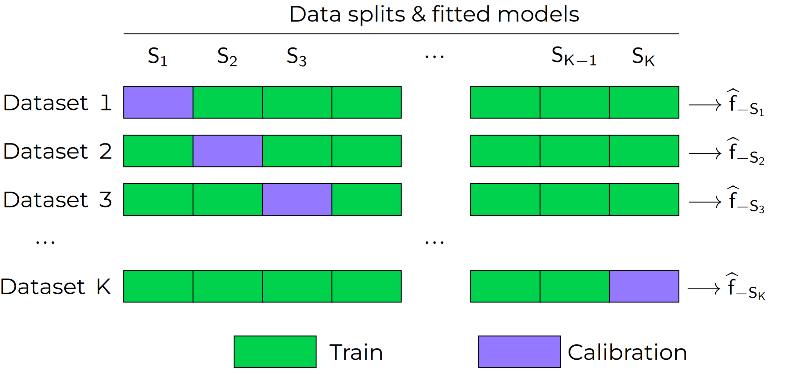

.. _theory_overview:

📈 Theory overview
===================

Uncertainty Quantification
--------------------------

In machine learning, we build predictive models from experience,
by choosing the right approach for the right problem, and from the accessible
data, via algorithms. Despite our best efforts, we can encounter some
underlying uncertainty that could stem from various sources or causes.

Typically, uncertainty in the machine learning process can be categorized into two types:
    - Aleatoric uncertainty, also known as statistical uncertainty, which is *irreducible* as due to the intrinsic randomness of the phenomenon being modeled
    - Epistemic uncertainty, also known as systematic uncertainty, which is *reducible* through additional information, e.g. via more data or better models

Depending on the application fields of machine learning models, uncertainty can have major impacts on performance and/or safety.

Conformal Prediction
--------------------

Conformal Prediction (CP) is a set of methods to estimate uncertainty
by constructing by constructing **valid** *prediction sets*, 
i.e. prediction sets with a probabilistic guarantee
of marginal coverage.
The following three features make CP methods particularly attractive:
    - *Distribution-free*. CP methods can be applied regardless of the underlying data-generating distribution.
    - *Model-agnostic*. CP works with any ML model, even with black-box models where we only have access to the outputs of the model.
    - *Non-asymptotic*. CP methods provide finite-sample probabilistic guarantees, that is, the guarantees hold without the need to assume that the number of available data grows to infinity.

Given an error rate (or significance level) :math:`\alpha \in (0,1)`, set by the user, a set of exchangeable (or more simply i.i.d.)
train data :math:`\{ (X_i, Y_i) \}_{i=1}^{n}` and a test point
:math:`(X_{new}, Y_{new})`,
all of which are generated from the same joint distribution :math:`\mathbb{P}_{XY}`,
a conformal prediction procedure uses the training data
to build prediction sets :math:`\widehat{C}_{\alpha}(\cdot)` so that:

.. math::

    \mathbb{P} \Big\{ Y_{new} \in \widehat{C}_{\alpha}\left(X_{new}\right) \Big\} \geq 1 - \alpha.

Over many calibration and test sets, :math:`\widehat{C}_{\alpha}(X_{new})` will contain
the observed values of :math:`Y_{new}` with frequency of *at least* :math:`(1-\alpha)`.

..
    Within the conformal prediction framework, the inequality above holds for any model,
    any data distribution :math:`\mathbb{P}_{XY}` and any finite sample sizes.

Usually, the conformal prediction method uses a point-predictor model :math:`\widehat{f}` 
and turns it into the set predictor :math:`C_\alpha` 
via a calibration procedure.
Within the conformal prediction framework, 
the inequality above holds for any model,
any data distribution :math:`\mathbb{P}_{XY}` and any training set sample size, under the following minimal assumptions:
    - *Exchangeability*. The data :math:`(X_1,Y_i),\dots, (X_n, Y_n), (X_{new}, Y_{new})` form an exchangeable sequence (this is a milder assumption than the data being i.i.d.).
    - *Independence of train and calibration data.* The data for the model training is independent from the data for the model calibration.

It is noteworthy that the coverage probability is marginalized over :math:`X`.
Therefore, the CP algorithm is likely to achieve the coverage rate of :math:`1-\alpha` 
by under-covering conditionally to some specific regions in the space of :math:`X` and over-covering in other regions.

Conformal prediction can act as a *post-processing procedure* to attain rigorous probability coverages,
as it can "conformalize" any existing predictor during or after training (black box predictors),
yielding marginally valid prediction sets.

In this page, we present the most common conformal prediction methods of the
literature used on regression and classification models. We also refer to
Angelopoulos and Bates [Angelopoulos2022]_ for a hands-on introduction to conformal prediction
and awesome conformal prediction `github <https://github.com/valeman/awesome-conformal-prediction>`_ for additional ressources.

In the following, let :math:`D = {(X_i, Y_i)}_{i=1}^n \sim P_{XY}`
be the training data and :math:`\alpha \in (0, 1)` the significance level (target maximum error rate).

Conformal Regression
--------------------

Split (inductive) Conformal
***************************
.. _theory splitcp:

The split (also called inductive) conformal prediction [Papadopoulos2002]_ [Lei2018]_ requires a hold-out calibration
dataset: the dataset :math:`D` is split into a proper training set 
:math:`D_{train}=\big\lbrace(X_i,Y_i), i=1,\dots,n_{train}\big\rbrace` 
and an independent calibration dataset :math:`D_{calib}=\big\lbrace(X_i,Y_i),i=1,\dots,n_{calib}\big\rbrace`. 
The purpose of the calibration dataset is
to estimate prediction errors and use them to build the prediction interval for a new sample :math:`X_{new}`.

Given a prediction model :math:`\widehat{f}` trained on :math:`D_{train}`, the algorithm is summarized in the following:

#. Choose a nonconformity score :math:`s`, and define the error :math:`R` over a sample :math:`(X,Y)` as :math:`R = s(\widehat{f}(X),Y)`. For example, one can pick the absolute deviation :math:`R = |\widehat{f}(X)-Y|`.
#. Compute the nonconformity scores on the calibration dataset: :math:`\mathcal{R} = \{R_i\}_{}`, where :math:`R_i=s(\widehat{f}(X_i), Y_i)` for :math:`i=1,\dots,n_{calib}`.
#. Compute the error margin :math:`\delta_{\alpha}` as the :math:`(1-\alpha)(1 + 1/n_{calib})`-th empirical quantile of :math:`\mathcal{R}`.
#. Build the prediction interval as

.. math::

    \widehat{C}_{\alpha}(X_{new}) = \Big[ \widehat{f}(X_{new}) - \delta_{\alpha} \,,\, \widehat{f}(X_{new}) + \delta_{\alpha} \Big].

Note that this procedure yields a constant-width prediction interval centered on the point estimate :math:`\widehat{f}(X_{new})`.

In the literature, the split conformal procedure has been combined with different nonconformity scores,
which produced several methods. Some of them are presented hereafter.

Locally Adaptive Conformal Regression
#####################################
.. _theory lacp:

The locally adaptive conformal regression [Papadopoulos2008]_ relies on scaled nonconformity scores:

.. math::

    R_i = \frac{|\widehat{f}(X_i) - Y_i|}{\widehat{\sigma}(X_i)},

where :math:`\widehat{\sigma}(X_i)` is a measure of dispersion of the nonconformity scores at :math:`X_i`.
Usually, :math:`\widehat{\sigma}` is trained to estimate the absolute prediction
error :math:`|\widehat{f}(X)-Y|` given :math:`X=x`. The prediction interval is again
centered on :math:`\widehat{f}(X_{new})` but the margins are scaled w.r.t the estimated local variability at :math:`Y | X = X_{new}`:

.. math::

    \widehat{C}_{\alpha}(X_{new})=
    \Big[ \widehat{f}(X_{new}) - \widehat{\sigma}(X_{new})\, \delta_{\alpha} \,,\, \widehat{f}(X_{new}) + \widehat{\sigma}(X_{new}) \, \delta_{\alpha} \Big].

The prediction intervals are therefore of variable width, which is more adaptive to heteroskedascity and
usually improve the conditional coverage. The price is the higher computational cost due to fitting two functions
:math:`\widehat{f}` and :math:`\widehat{\sigma}`, on the proper training set.

Conformalized Quantile Regression (CQR)
#######################################
.. _theory cqr:

Split conformal prediction can be extended to `quantile predictors <https://en.wikipedia.org/wiki/Quantile_regression>`_  :math:`q(\cdot)`.
Given a nominal error rate :math:`\alpha,`
and positive error rates :math:`\alpha_{lo}` 
and :math:`\alpha_{hi}` 
such that :math:`\alpha_{lo}+\alpha_{hi}=1,`
we denote by :math:`\widehat{q}_{\alpha_{lo}}` and 
:math:`\widehat{q}_{1-\alpha_{hi}}`
the predictors of the :math:`\alpha_{lo}` *-th* and :math:`(1-\alpha_{hi})` *-th* quantiles of :math:`Y | X.`
The quantile predictors are trained on :math:`D_{train}`
and calibrated on :math:`D_{calib}` 
by using the following nonconformity score:

.. math::

    R_i^{} = \text{max}\{ \widehat{q}_{\alpha_{lo}}(X_i) - Y_i, Y_i - \widehat{q}_{1 - \alpha_{hi}}(X_i)\},

For example, if we set :math:`\alpha = 0.1`, we would fit two predictors :math:`\widehat{q}_{0.05}(\cdot)` and :math:`\widehat{q}_{0.95}(\cdot)` on training data :math:`D_{train}` and compute the scores on :math:`D_{calibration}`.

.. note::

    It is common to split evenly :math:`\alpha` as: :math:`\alpha_{lo} = \alpha_{hi}= \frac{\alpha}{2}`, but users are free to do otherwise.

The procedure, named *Conformalized Quantile Regression* [Romano2019]_, yields the following prediction interval:

.. math::

    \widehat{C}_{\alpha}(X_{new}) = \Big[ \widehat{q}_{\alpha_{lo}}(X_{new}) - \delta_{\alpha} \,,\, \widehat{q}_{1 - \alpha_{hi}}(X_{new}) + \delta_{\alpha} \Big].

When data are exchangeable, the correction margin :math:`\delta_{\alpha}` guarantees finite-sample marginal coverage for the quantile predictions, and this holds also for misspecified (i.e. "bad") predictors.

If the fitted :math:`\widehat{q}_{\alpha_{lo}}` and :math:`\widehat{q}_{1-\alpha_{hi}}` approximate (empirically) well  the conditional distribution :math:`Y | X` of the data, we will get a small margin :math:`\delta_{\alpha}`: this means that on average, the prediction errors on the :math:`D_{calib}` were small.

Also, if the base predictors have strong theoretical properties, our CP procedure inherits these properties of :math:`\widehat{q}_{}(\cdot)`.
We could have an asymptotically, conditionally accurate predictor and also have a theoretically valid, distribution-free guarantee on the marginal coverage!

..
    Weighted Split Conformal
    ########################
    .. _theory weightedcp:

Cross-validation+ (CV+), Jackknife+
************************************
.. _theory cvplus:

The `leave-one-out (LOO) and the k-fold cross-validation <https://en.wikipedia.org/wiki/Cross-validation_(statistics)>`_ are well known schemes used to estimate regression residuals on out-of-sample data.
As shown below, one first splits the data into K partitions and then *holds out* a partition at a time to compute errors (nonconformity scores, in our case).
Following this principle, [Barber2021]_ introduced the LOO *jackknife+* (JP) and the k-fold *Cross-validation+* (CV+).
With these methods, one does *not need* a dedicated calibration set.

|

The CV+ algorithm goes as follows.
Let :math:`n = |D_{train}|`, and let :math:`D_{train}` be partitioned disjointly into the sets :math:`S_1, S_2, \dots, S_K`.
Each training point :math:`(X_i,Y_i) \in D_{train}` belongs to one partition, noted as :math:`S_{k(i)}`.

At training, we fit and store in memory :math:`K` models, referred to as :math:`\widehat{f}_{-S_{K}}` to indicate that it was fitted using all data points *except* those in partition :math:`S_{K}`.
Then, the conformalization step boils down to computing, for each :math:`(X_i,Y_i) \in D_{train}`, the score:

.. math::
    R_i^{CV} = | Y_i - \widehat{f}_{-S_{k(i)}}(X_i)|, i=1, \dots, n

If :math:`K = n`, we obtain the *Jackknife+*, **leave-one-out** version of the algorithm.

**Inference**

.. Let :math:`(X_{new}, Y_{new})` be a test point, where :math:`Y_{new}` is not observable at inference time.

The lower and upper bounds of the prediction interval are given by:

    #. Compute :math:`\bar{R}_{L} = \{ \widehat{f}_{-S_{k(i)}}(X_{new}) - R_i^{CV} \}_{i=1}^{n}`
    #. :math:`\widehat{L}_{\alpha}(X_{new}) = \lfloor \alpha (n+1) \rfloor`-th smallest value in :math:`\bar{R}_{L}` (lower bound)
    #. Compute :math:`\bar{R}_{U} = \{ \widehat{f}_{-S_{k(i)}}(X_{new}) + R_i^{CV} \}_{i=1}^{n}`
    #. :math:`\widehat{U}_{\alpha}(X_{new}) = \lceil (1-\alpha) (n+1) \rceil`-th smallest value in :math:`\bar{R}_{U}` (upper bound)

.. math::

    \widehat{C}_{\alpha}(X_{new}) = \Big[ \widehat{L}_{\alpha}(X_{new}), \widehat{U}_{\alpha}(X_{new}) \Big].

Ensemble Batch Prediction Intervals (EnbPI)
*******************************************
.. _theory enbpi:

Introduced in [Xu2021]_, 
the EnbPI algorithm builds prediction intervals 
for time series data of the form 
:math:`Y_t = f(X_t) + \epsilon_t`, 
where :math:`\epsilon_t` are identically distributed, 
but not necessarily independent. 
Given a training data set :math:`D=\lbrace (X_i, Y_i) \rbrace_{i=1}^n` 
and a test set :math:`D_{test} = \lbrace (X_t,Y_t) \rbrace_{t=n+1}^{n_{test}}`, 
the EnbPI algorithm aims at constructing prediction sets 
for each test point :math:`X_t`. 
As with the CV+ or Jackknife+ methods, 
the EnbPI algorithm does not require a held-out calibration set, 
as it uses a bootstrap algorithm instead. 
Let :math:`\mathcal{A}` be a training algorithm 
(i.e. an algorithm that maps a dataset to a predictor), 
and :math:`\phi` an aggregation function 
that aggregates different individual models together, 
e.g. via a simple average, a bagging or an ensembling method. 
The algorithm EnbPI is performed in three stages:

**Training**
    #. Sample :math:`B` bootstrap data sets :math:`S_b`, for :math:`b=1,\dots, B` with replacement from :math:`D`.
    #. Train :math:`B` bootstrap models :math:`\widehat{f}^b = \mathcal{A}(S_b)`.

**Calibration**
    #. Compute the predictions on each training sample :math:`X_i\in D`. Only the models :math:`\widehat{f}^b` where :math:`X_i\not\in S_b` are used in the aggregation: :math:`\widehat{f}_{-i}(X_i):=\phi\big( \lbrace \widehat{f}^b(X_i) | X_i\not\in S_b\rbrace\big)`.
    #. Compute the errors :math:`R_i=|Y_i-\widehat{f}_{-i}(X_i)|`, and stock them as :math:`\mathcal{R}_1:=\lbrace R_i,i=1,\dots, n\rbrace`.

**Inference**
    #. Compute the predictions on each test sample :math:`X_t\in D_{test}` by setting :math:`\widehat{f}_{-t}(X_t):=  \frac{1}{T}\sum_{i=1}^T \widehat{f}_{-i}(X_t)`.
    #. Update the error set: :math:`\mathcal R_t` (see below).
    #. Compute the width of the prediction intervals :math:`\delta_{\alpha, t}` as the :math:`(1-\alpha)`-th empirical quantile of :math:`\mathcal{R}_t`.

The prediction interval for :math:`X_t` is then given by 

.. math::
    
    \widehat{C}_{\alpha} = \big[ \widehat{f}_{-t}(X_t)-\delta_{\alpha, t}, \widehat{f}_{-t}(X_t)+\delta_{\alpha, t}].

In order to update the error set :math:`\mathcal{R}_t`, 
a *memory* parameter :math:`s` is employed. 
Every :math:`s` test examples, the first :math:`s` errors in the set 
:math:`\mathcal{R}` are dropped and the errors over the last :math:`s` 
test examples are added to the error set :math:`\mathcal{R}`. 
I.e. if :math:`t-n = 0\ mod\ s` then :math:`\mathcal{R}_t = \lbrace R_i, i=t-n,\dots,t-1\rbrace` 
and if :math:`t-n \neq 0\ mod\ s` then :math:`\mathcal{R}_t=\mathcal{R}_{t-1}`. 

.. note::

    The EnbPI algorithm does not provide an exact probabilistic guarantee as the previous CP methods do. 
    The guarantee provided by the EnbPI algorithm is only approximate, 
    and holds under additional assumptions on the error process 
    :math:`\epsilon_t`. However, it does not require the data to be exchangeable.

.. Introduced in [Xu2021]_, the EnbPI algorithms builds prediction intervals for time series data of the form :math:`Y_t = f(X_t) + \epsilon_t`, where :math:`\epsilon_t` are identically distributed.
.. Unlike the proper conformal algorithms seen above, EnbPI requires some additional hypothesis to attain the coverage guarantee.

..
    Summary: guarantees
    *******************
    .. _theory guarantees:

    * split
    * JP

Conformal Classification
------------------------

.. Let :math:`[ \pi_a(x), \pi_b(x), \dots, \pi_z(x) ] = [\widehat{f}(x|Y=a), \widehat{f}(x|Y=b), \dots] = \widehat{f}(x)` be the output scores (e.g. softmax) of classifier :math:`\widehat{f}`,  and :math:`\pi_{(1)}(x), \pi_{(2)}(x), \dots, \pi_{(K)}(x)` the sequence of scores sorted in decreasing order.

.. That is, :math:`\pi_{j \in \{a, b, \dots \}}(x)` is the score :math:`\in [0,1]` that quantifies how likely it is that ":math:`Y=j` is the true (unknown) label for x" according to the classifier :math:`\widehat{f}` trained on some data.
.. The prediction is chosen to be the **most likely** label, which can be written as :math:`\text{argmax}_{1,2, \dots, K} \widehat{f}(x) = \pi_{(1)}(x)`.

.. In practice, this prediction could be subject to uncertainty and conformal methods build **sets of likely labels** :math:`C(x)` such that :math:`P\{Y \in C(x) \} \geq 1 - \alpha`.

.. For example, let :math:`S(x; l) = \sum_{j \leq l} \pi_{(j)}(x)` be the sum of the first, sorted, :math:`l` output scores.
.. The set :math:`\tilde{C}(x; \beta) = \{y |  \text{min}_l S(x; l) \geq \beta \}` for :math:`\beta := 1 - \alpha` such that :math:`P\{Y \in C(x; l) \} \geq 1 - \alpha`

Adaptive Prediction Sets (APS)
*******************************************
.. _theory aps:

As for the Split Conformal Regression algorithm, 
the APS algorithm introduced in [Romano2020]_ 
requires us to split the data set :math:`D` into a proper training set :math:`D_{train}` 
and an independent calibration set :math:`D_{calib}`. 
A classifier :math:`\widehat{\pi}` is trained 
using the proper training set :math:`D_{train}` only. 
We assume that the output of the classifier is given by the softmax scores for the different classes. 
I.e. for each input :math:`x`, 
the output :math:`\widehat{\pi}(x)=(\widehat{\pi}_1(x),\dots,\widehat{\pi}_K(x))` 
is a probability vector and :math:`k=1,\dots, K` 
represent the possible different classes in the classification task.
 We represent by :math:`\widehat{\pi}_{(1)}(x)\geq \cdots\geq \widehat{\pi}_{(K)}(x)` 
 the softmax vector :math:`\widehat{\pi}` arranged in decreasing order, 
 i.e. :math:`(k)` is the index of the class having the :math:`k`-th largest probability mass.

In order to construct the prediction sets :math:`\widehat{C}_\alpha`, 
the APS algorithm works in two stages:

**Calibration**
    #. For each example :math:`X_i` in the calibration data set, we compute the error :math:`R_i` as the probability mass needed for reaching the true label :math:`Y_i`, i.e. :math:`R_i=\widehat{\pi}_{(1)}+\cdots+\widehat{\pi}_{(k)}`, wehere :math:`(k)=Y_i`.
    #. Stock all errors in a vector :math:`\mathcal{R}`.

**Inference**
    #. Compute the error margin :math:`\delta_{\alpha}` as the :math:`(1-\alpha)(1 + 1/n_{calib})`-th empirical quantile of :math:`\mathcal{R}`.
    #. The prediction set for a test point :math:`X_{new}` is defined as
    
    .. math::
        \widehat{C}_{\alpha}(X_{new})=\big\lbrace
        (1),\dots,(k)
        \big\rbrace\quad \text{where}\quad 
        k = \min\big\lbrace i : \widehat{\pi}_{(1)}+\cdots+\widehat{\pi}_{(i)}\geq \delta_\alpha\big\rbrace.

Regularized Adaptive Prediction Sets (RAPS)
*******************************************
.. _theory raps:

Source: [Angelopoulos2021]_

TBC

Conformal Anomaly Detection
---------------------------

TBC

Conformal Object Detection
--------------------------
.. _theory splitboxwise:

Source: [deGrancey2022]_

TBC

References
----------

.. [Angelopoulos2021] Angelopoulos, A. N., Bates, S., Jordan, M., & Malik, J (2021). Uncertainty Sets for Image Classifiers using Conformal Prediction. In Proceedings of ICLR 2021. https://openreview.net/forum?id=eNdiU_DbM9
.. [Angelopoulos2022] Angelopoulos, A.N. and Bates, S., (2021). A gentle introduction to conformal prediction and distribution-free uncertainty quantification. arXiv preprint arXiv:2107.07511. https://arxiv.org/abs/2107.07511
.. [Barber2021] Barber, R. F., Candes, E. J., Ramdas, A., & Tibshirani, R. J. (2021). Predictive inference with the jackknife+. Ann. Statist. 49 (1) 486 - 507, February 2021. https://arxiv.org/abs/1905.02928
.. [Lei2018] Lei, J., G'Sell, M., Rinaldo, A., Tibshirani, R.J. and Wasserman, L., (2018). Distribution-free predictive inference for regression. Journal of the American Statistical Association, 113(523), pp.1094-1111. https://arxiv.org/abs/1604.04173
.. [Papadopoulos2002] Papadopoulos, H., Proedrou, K., Vovk, V. and Gammerman, A., (2002). Inductive confidence machines for regression. In Proceedings of ECML 2002, Springer. https://link.springer.com/chapter/10.1007/3-540-36755-1_29
.. [Papadopoulos2008] Papadopoulos, H., Gammerman, A. and Vovk, V., (2008). Normalized nonconformity measures for regression conformal prediction. In Proceedings of the IASTED International Conference on Artificial Intelligence and Applications (AIA 2008) (pp. 64-69).
.. [deGrancey2022] de Grancey, F., Adam, J.L., Alecu, L., Gerchinovitz, S., Mamalet, F. and Vigouroux, D., 2022, June. Object detection with probabilistic guarantees: A conformal prediction approach. In International Conference on Computer Safety, Reliability, and Security.
.. [Romano2019] Romano, Y., Patterson, E. and Candes, E., (2019). Conformalized quantile regression. In Proceedings of NeurIPS, 32. https://arxiv.org/abs/1905.03222
.. [Romano2020] Romano, Y., Sesia, M., & Candes, E. (2020). Classification with valid and adaptive coverage. In Proceedings of NeurIPS, 33. https://arxiv.org/abs/2006.02544
.. [Xu2021] Xu, C. & Xie, Y.. (2021). Conformal prediction interval for dynamic time-series. Proceedings of ICML 2021. https://proceedings.mlr.press/v139/xu21h.html.
